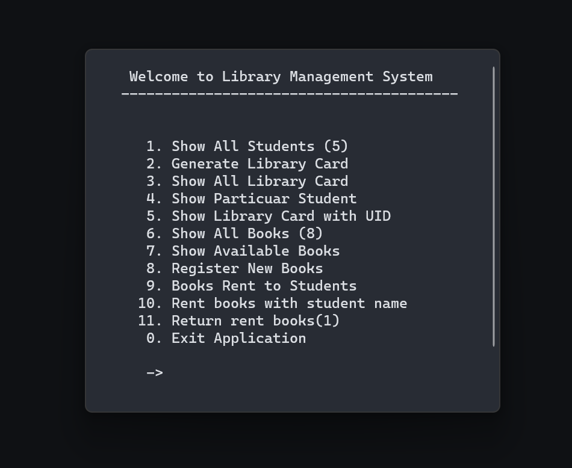
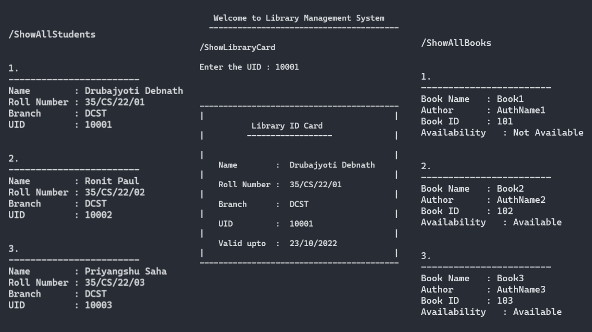

# Library Management System

This is a simple library management system implemented in C++. 



## Features

- **Flat-File Database**: The system uses a flat-file database to store data, enhancing data consistency and retrieval efficiency.
- **Custom Modules**: The system is built with over 5 custom-created modules in native C++.
- **Student Entry and ID Card Generation**: The system includes a feature for student entry and ID card generation.

- **Book Inventory Operations**: The system oversees book inventory operations, ensuring book IDs and allocation.

<br>



## Getting Started

These instructions will get you a copy of the project up and running on your local machine for development and testing purposes.

### Prerequisites

- A C++ compiler (GCC recommended)
- Basic knowledge of C++ programming

### Installing

1. Clone the repository to your local machine.
   
   ```{bash}
   git clone https://github.com/unknown009d/simpleLibraryManagement.git
   ```
3. Navigate to the project directory.
   
   ```{bash}
   cd simpleLibraryManagement
   ```
5. Compile the project using your C++ compiler.

   ```{bash}
   gcc main.cpp
   ```
6. Run the compiled file.
   
   ```{bash}
   ./a.out
   ```

## Usage

After running the compiled file, follow the prompts in the command line to use the library management system.
